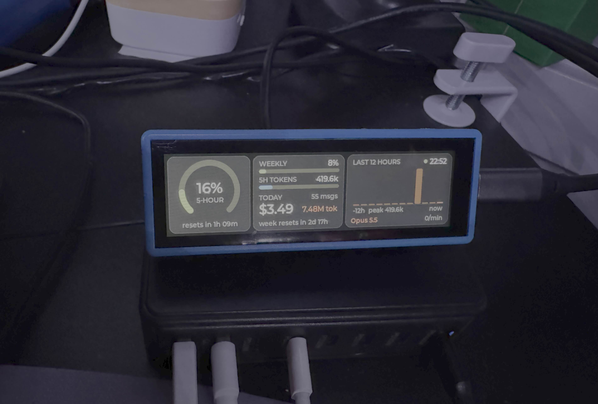

# RP2350Touch3.49



## Claude Usage Display

The firmware shows your Claude usage on the 3.49" screen in landscape (640×172):

- **Left:** the current 5-hour window as an arc (green < 60%, orange < 85%,
  red above), with the time until it resets.
- **Middle:** weekly limit bars (all models, plus a per-model limit if your plan
  has one), and today's messages, tokens and API-equivalent cost.
- **Right:** tokens per hour over the last 12 hours, the model you used last,
  the recent burn rate, and the Mac's clock. The dot beside the clock is green
  while updates are arriving, amber once they stop for 2 minutes.

Tap the screen to cycle the backlight brightness.

### How the data gets there

The board has no Wi-Fi or Bluetooth radio, so the Mac sends the numbers over the
same USB cable that powers it (USB CDC serial, `/dev/cu.usbmodem*`). No drivers
are needed.

`tools/claude_usage_host.py` runs on the Mac. It only needs the Python 3
standard library:

```sh
python3 tools/claude_usage_host.py            # finds the board and updates it every 15 s
python3 tools/claude_usage_host.py --print    # dry run: print what it would send
python3 tools/claude_usage_host.py --demo     # random numbers, to test the screen
```

It reads two things:

1. **Claude Code's local logs**, `~/.claude/projects/**/*.jsonl` (also
   `~/.config/claude/projects` and `$CLAUDE_CONFIG_DIR`). Each assistant message
   there records its token usage, which gives the totals, the hourly history and
   the burn rate. Cost is estimated from list API prices. It isn't what a Pro or
   Max subscription charges you.
2. **Your plan limits**: the same 5-hour and weekly percentages that Claude
   Code's `/usage` shows. These come from an unofficial endpoint
   (`api.anthropic.com/api/oauth/usage`) and need an OAuth token. The script
   looks for one in this order:
   - `$CLAUDE_CODE_OAUTH_TOKEN`
   - the file `~/.config/claude-usage-display/token` (or `--token-file`)
   - the token Claude Code keeps in the macOS keychain (`Claude Code-credentials`)
     once you've logged in. The first time, macOS asks whether `security` may
     read it.

   The script only reads tokens and never refreshes them. Without a working
   token, or with `--no-limits`, the arc shows an estimate instead, labelled
   `5-HOUR est.`. The estimate compares the current window's cost with your
   busiest earlier window, or with `--block-limit USD`.

Only Claude Code **running on this Mac** writes the logs. Usage in the Claude
app, on claude.ai or in Claude Code on the web leaves nothing in `~/.claude`, so
if that's where you use Claude, every local number stays at 0. Those sessions
do count towards the plan limits, so for them you need a working token. The
keychain token expires within hours unless Claude Code runs on the Mac and
renews it. For a token that lasts, run `claude setup-token` (it needs Claude
Code installed and a Claude subscription) and save what it prints:

```sh
mkdir -p ~/.config/claude-usage-display
pbpaste > ~/.config/claude-usage-display/token   # after copying the token
chmod 600 ~/.config/claude-usage-display/token
```

When numbers are estimated or missing, the host sends a short reason, and the
board shows it in amber under the arc: `no usage data on Mac`,
`limits: no token`, `limits: token expired` or `limits: no access`.

To see what the script finds without starting it, run:

```sh
python3 tools/claude_usage_host.py --check
```

It lists the log folders and how many records they hold, where the token came
from and whether the limits request works, and whether the board answers and
acknowledges a test update. While running, the script also logs a one-line
summary whenever the values it sends change.

To start it automatically at login, save this as
`~/Library/LaunchAgents/com.claude-usage.display.plist` (fix the path), then
run `launchctl load ~/Library/LaunchAgents/com.claude-usage.display.plist`:

```xml
<?xml version="1.0" encoding="UTF-8"?>
<!DOCTYPE plist PUBLIC "-//Apple//DTD PLIST 1.0//EN" "http://www.apple.com/DTDs/PropertyList-1.0.dtd">
<plist version="1.0"><dict>
  <key>Label</key><string>com.claude-usage.display</string>
  <key>ProgramArguments</key><array>
    <string>/usr/bin/python3</string>
    <string>/path/to/RP2350Touch3.49/tools/claude_usage_host.py</string>
  </array>
  <key>RunAtLoad</key><true/>
  <key>KeepAlive</key><true/>
</dict></plist>
```

### Serial protocol

One line per message, newline terminated:

| Direction | Line | Reply |
|---|---|---|
| Mac → board | `@PING` | `@PONG claude-usage 1` (used to find the port) |
| Mac → board | `@CU key=value;key=value;...` | `@OK` |

| Key | Meaning |
|---|---|
| `sp`, `sr` | 5-hour window: percent used, minutes until reset (`-1` = unknown) |
| `wp`, `wr` | Weekly limit: percent used, minutes until reset |
| `w2p`, `w2l` | Per-model weekly limit: percent, label (e.g. `SONNET`) |
| `tt`, `tc`, `tm` | Today: tokens, cost in US cents, messages |
| `bt`, `br` | Tokens in the current 5-hour window, tokens per minute recently |
| `h` | 12 comma-separated hourly token counts, oldest first |
| `m`, `t`, `src` | Model name, Mac clock `HH:MM`, `o` = limits from the API / `l` = local estimate |
| `st` | Short note shown under the arc when numbers are estimated or zero (empty when all is well) |

The firmware side is `src/SerialLink.cpp` (parser) and `src/UsageScreen.cpp` (UI).

### Landscape mode

LVGL renders a 640×172 frame, and the flush callback in `port/lvgl/lv_port.c`
rotates it into the panel's native 172×640 scan order. It fills two small
32-row buffers in turn, rotating into one while DMA sends the other, so it
doesn't need a second 220 KB frame buffer. Touch coordinates are rotated to
match. `DISP_ROTATION` in `port/lvgl/lv_port.h` picks 90° or 270°; flip it if
the picture is upside down for how you mount the board. `DISP_LANDSCAPE 0`
restores the original portrait behaviour.

## Building

### 1. Install the Pico SDK

RP2350 support requires Pico SDK 2.0.0 or newer. Clone it with submodules:

```sh
git clone --depth 1 --branch 2.1.1 https://github.com/raspberrypi/pico-sdk.git ~/pico-sdk
cd ~/pico-sdk
git submodule update --init --depth 1
```

### 2. Install the ARM cross-compiler

Do **not** use Homebrew's `arm-none-eabi-gcc` formula — it ships without newlib
(missing `nosys.specs`), which breaks linking. Use the official ARM GNU Toolchain
instead. On Apple Silicon:

```sh
curl -L -o /tmp/arm-toolchain.tar.xz \
  "https://developer.arm.com/-/media/Files/downloads/gnu/14.2.rel1/binrel/arm-gnu-toolchain-14.2.rel1-darwin-arm64-arm-none-eabi.tar.xz"
mkdir -p ~/.local
tar -xf /tmp/arm-toolchain.tar.xz -C ~/.local
```

(For Intel Macs, swap `arm64` for `x86_64` in the URL. For Linux, use the
`x86_64-linux` tarball, or `brew install --cask gcc-arm-embedded` on macOS if
you're able to enter a sudo password interactively.)

Also install `picotool`, used by the SDK's post-build steps:

```sh
brew install picotool
```

### 3. Set environment variables

```sh
export PICO_SDK_PATH=~/pico-sdk
export PATH="$HOME/.local/arm-gnu-toolchain-14.2.rel1-darwin-arm64-arm-none-eabi/bin:$PATH"
```

Add these to your `~/.zshrc` (or equivalent) to avoid re-exporting them every session.

The project includes its own copy of `pico_sdk_import.cmake`, so instead of the
environment variable you can also pass `-DPICO_SDK_PATH=~/pico-sdk` to `cmake`, or set
`PICO_SDK_FETCH_FROM_GIT=1` to have CMake download the SDK.

> **Board header note:** Waveshare's own `waveshare_rp2350_touch_lcd_3.49.h` uses
> `pico_board_cmake_set(PICO_PLATFORM, rp2350)`, a syntax added in Pico SDK 2.2.0.
> SDK 2.1.x doesn't define that macro, so the header fails to compile there. The copy
> in `boards/` uses the older comment form, `// pico_cmake_set PICO_PLATFORM=rp2350`,
> which SDK 2.1.x and 2.2.0+ both understand.

### 4. Configure and build

```sh
mkdir -p build && cd build
cmake -G Ninja ..
ninja
# or
cd build && cmake -G Ninja .. && ninja
```

### 5. Flash
Put the board in BOOTSEL mode first, then:
```sh
ninja install
# or
picotool load build/src/LVGL.uf2 -v
picotool reboot
```

The resulting firmware is at `build/src/LVGL.uf2` — copy it to the board while
it's in BOOTSEL mode to flash, or run `ninja install` to flash it via `picotool`
directly (board must be in BOOTSEL mode and `picotool` on `PATH`).

## LVGL port

LVGL v8.1.0 is vendored in `lib/lvgl` and is essentially upstream. The
board-specific code lives outside it, in `port/lvgl/` and `lvgl.cmake`.

### Changes to LVGL itself

- `lib/lvgl/src/core/lv_refr.c` is the only source file that differs from upstream.
  The perf/memory monitor overlays get zero padding, a fixed 120px width on the
  perf label and a 1px offset on the memory label, to suit the narrow 172px
  screen. Both monitors are disabled by default.
- `lib/lvgl/CMakeLists.txt` is replaced with a minimal Pico-style file. It is not
  used; the build goes through the top-level `lvgl.cmake`.

### The port

- **`lvgl.cmake`** builds LVGL as a static library from `lib/lvgl/src` plus
  `port/lvgl`, and links it against `touch349` (the board drivers). `lv_conf.h`
  lives in `port/lvgl`, outside the vendored library.
- **`port/lvgl/lv_conf.h`** differs from LVGL's `lv_conf_template.h` as follows:
  - `LV_COLOR_16_SWAP 1`, because the QSPI panel expects byte-swapped RGB565.
  - `LV_DISP_DEF_REFR_PERIOD` 30 ms → 10 ms.
  - Montserrat 16/24/26/28/30 enabled, and `LV_FONT_DEFAULT` 14 → 24.
  - Monitor positions moved to `LV_ALIGN_LEFT_MID` / `LV_ALIGN_RIGHT_MID`.
- **`port/lvgl/lv_port.c`** (`LVGL_Init()`) connects LVGL to the hardware. The
  panel is 172×640 (portrait). LVGL sees it as 640×172 landscape by default
  (see [Landscape mode](#landscape-mode)):
  - **Display:** one full-screen draw buffer with `full_refresh`. In portrait
    mode the flush callback sets the LCD window, sends `0x2C` (RAMWR) over QSPI
    and starts a DMA transfer into the PIO TX FIFO. The DMA IRQ deselects the
    chip and calls `lv_disp_flush_ready()`, so flushing is asynchronous. In
    landscape mode the flush rotates and sends the frame in chunks and waits
    for them to finish, so it is synchronous.
  - **Touch:** a GPIO falling-edge IRQ reads the touch controller and latches
    x/y. The LVGL pointer read callback reports one `PRESSED` and then `RELEASED`.
  - **Tick:** a 5 ms repeating timer calls `lv_tick_inc(5)`. This is the only
    tick source; don't add another.

### Fixes to the Waveshare-derived code

- The draw buffer is now allocated as `DISP_HOR_RES * DISP_VER_RES *
  sizeof(lv_color_t)`. It was previously missing the `sizeof`, so at 16-bit color
  it was half the size LVGL was told it had.
- `LCD_3in49.c` included `"LCD_3IN49.h"`, which only works on a case-insensitive
  file system such as macOS's default. It now matches the file name, so the
  project also builds on Linux.
- The duplicate `lv_tick_inc()` timer in `main.cpp` was removed. With both timers
  running, LVGL's clock ran at about 2× real time.

## Audio and SD card

Drivers for the ES8311 audio codec and the micro SD card are taken from Waveshare's
`02-ES8311` and `03-FatFs` demos for this board. Both are built and linked into the
firmware, but the demo app doesn't use them yet.

### Audio (ES8311)

- `lib/touch349/ES8311`: codec driver over I2C (address `0x18`). It shares the I2C1
  bus with the RTC and IMU.
- `lib/touch349/Audio_PIO`: I2S via PIO. `pico_audio` holds the sample rate
  (24 kHz), bit depth (16), volume and pins.
- `lib/touch349/Audio_Data`: test tones (440 Hz sine, "Happy Birthday").
- `tools/wav2data.py`: converts a 24 kHz, 16-bit mono WAV into a C array.

Minimal playback:

```c
es8311_init(pico_audio);   // also switches on the speaker amplifier (PA_CTRL)
es8311_sample_frequency_config(pico_audio.mclk_freq, pico_audio.sample_freq);
es8311_voice_volume_set(pico_audio.volume);
Sine_440hz_out();          // blocks forever
```

The Waveshare output functions (`Sine_440hz_out`, `Happy_birthday_out`,
`Loopback_test`) loop forever using blocking PIO writes. Run them on a core that
isn't driving LVGL, or feed samples with `pio_sm_put_blocking()` from your own loop.

Changes from Waveshare's code:

- Uses this project's `DEV_Config` (`DEV_I2C_Write_Byte` / `DEV_I2C_Read_Byte`)
  instead of the demo's own copy.
- `es8311_init()` now drives `PA_CTRL` (GPIO 0) high to enable the speaker
  amplifier. The demo did this in its own `DEV_Module_Init()`.
- `pico_audio` is defined once in `audio_pio.c`. It was previously a `static` in
  the header, which gave every file its own copy.
- `Music_out()` and its `music.h` song data (about 18 MB of source) were left out.
  Use `tools/wav2data.py` to generate your own.
- The `audio_pio.pio.h` header is generated at build time rather than checked in.
- `tools/wav2data.py`: fixed an unterminated string that stopped the script from
  running.

### SD card (FatFs)

- `lib/no-OS-FatFS-SD-SDIO-SPI-RPi-Pico`: Carl Kugler's FatFs + SD driver library,
  v3.3.1 (upstream commit `aca1922`), as shipped by Waveshare. Link the `sdcard`
  target (defined in `fatfs.cmake`) to use it.
- `port/fatfs/hw_config.c`: this board's card configuration. It is a single card in
  SPI mode, mounted as `"0:"`.

```c
FATFS fs;
FIL fil;
if (f_mount(&fs, "0:", 1) == FR_OK &&
    f_open(&fil, "0:/test.txt", FA_READ) == FR_OK) {
    /* f_read / f_gets ... */
    f_close(&fil);
}
```

Waveshare's changes to the upstream library:

- Their `hw_config.h` defines `SPI_SD0`, which selects SPI mode.
- Their `rp2040_sdio.pio` uses `wait gpio` instead of `wait pin`.
- They removed the upstream reference folders (`SdFat`, `ZuluSCSI-firmware`,
  `mbed-os`).
- They added an unused `rtc.c`/`rtc.h`.

Waveshare's `hw_config.c` declared four card slots on the same pins, one of them
SDIO with no PIO assigned. The board copy in `port/fatfs` keeps only the real SPI
slot. Waveshare's copy didn't include the library's Apache-2.0 `LICENSE`, so it was
restored from upstream.

### Pin and resource map

| Function | Pins | Peripheral |
|---|---|---|
| LCD (QSPI) | CS 25, SCLK 20, D0–D3 21–24, RST 34, PWR 37 | `pio0`, 1 DMA channel + `DMA_IRQ_0` |
| LCD backlight | 36 | PWM |
| Touch | SDA 32, SCL 33, INT 11 | `i2c0` |
| RTC, IMU, ES8311 | SDA 6, SCL 7 (IMU INT 8) | `i2c1` |
| Audio I2S | DOUT 1, DIN 2, MCLK 3, BCLK 4, LRCLK 5 | `pio1` SM1–2, `pio2` SM0 |
| Speaker amp enable | 0 (`PA_CTRL`) | GPIO |
| SD card (SPI) | SCK 26, MOSI 27, MISO 28, CS 31 | `spi1`, 2 DMA channels (no IRQ) |
| Power button / hold | 38 / 39 | GPIO |
| Battery | 40 | ADC 0 |

## Credits

This project builds on the work of [Dr Jon Durrant](https://github.com/jondurrant),
whose LVGL port and widget code for the Waveshare RP2350 Touch LCD 3.49 form the
foundation of this project.

His port is in turn adapted from the LVGL demo and hardware drivers supplied by
[Waveshare](https://www.waveshare.com) for the board: the LCD, touch, QSPI PIO and
device config code in `lib/touch349`, and the display/touch glue in
`port/lvgl/lv_port.c`.

The ES8311 audio code (`lib/touch349/ES8311`, `Audio_PIO`, `Audio_Data`,
`tools/wav2data.py`) and the SD card setup also come from Waveshare's demos for this
board.

The UI is built with [LVGL](https://lvgl.io) v8.1.0, vendored in `lib/lvgl`.

SD card support uses
[no-OS-FatFS-SD-SDIO-SPI-RPi-Pico](https://github.com/carlk3/no-OS-FatFS-SD-SDIO-SPI-RPi-Pico)
by Carl John Kugler III (Apache-2.0, see its `LICENSE`), which is built on ChaN's
[FatFs](http://elm-chan.org/fsw/ff/00index_e.html).

## License

Released under the [MIT License](LICENSE). Vendored libraries in `lib/` keep their
own licenses.
